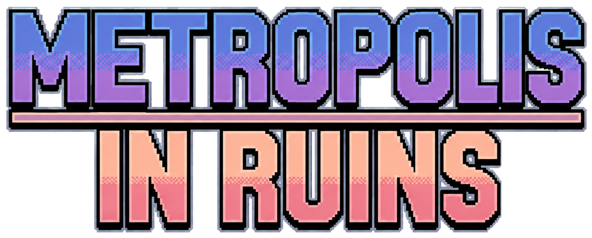

<div align="center">



### Estratégia econômica, negociação e caos urbano em uma metrópole à beira do colapso.

[](https://godotengine.org/)
[](https://docs.godotengine.org/)
[](https://developer.android.com/)
[](https://www.photonengine.com/fusion)
[](#estado-do-projeto)

</div>

---

## Sobre o jogo

**Metropolis in Ruins** é um jogo de tabuleiro digital de estratégia econômica para **2 a 6 jogadores**, desenvolvido em **Godot 4**.

Em uma cidade marcada por crises, especulação e disputas políticas, cada jogador assume um personagem com habilidades próprias. O objetivo é comprar propriedades, formar monopólios, construir prédios, cobrar aluguéis, negociar com adversários e sobreviver aos eventos que transformam a economia da metrópole.

A partida mistura administração de patrimônio, leitura de risco, acordos entre jogadores, cartas, leilões e poderes assimétricos. Nem sempre vence quem compra mais — reputação, timing e capacidade de adaptação também fazem diferença.

> O projeto está em desenvolvimento ativo e tem como foco atual estabilidade, polimento, experiência mobile e confiabilidade das partidas multiplayer.

## Principais recursos

- **Partidas para até 6 jogadores** com seleção exclusiva de personagens.
- **Multiplayer online** por salas com código usando Photon Fusion.
- **Modo LAN** por ENet para jogadores conectados à mesma rede.
- **Tutorial jogável contra IA**, com compra, negociação, monopólio, construção e uma partida rápida guiada.
- **Seis personagens assimétricos**, cada um com passivas, bônus e habilidade ativa.
- **Propriedades, grupos de cores, monopólios, hipotecas, prédios e hotéis**.
- **Leilões** quando um terreno disponível não é comprado diretamente.
- **Negociações completas** envolvendo dinheiro, propriedades, imunidade de aluguel e passes de transporte.
- **Alianças, promessas e reputação**, com consequências para acordos cumpridos ou quebrados.
- **Eventos globais** que alteram temporariamente as regras da cidade.
- **Cartas de Destino da Cidade e Ordem Urbana**, com bônus, cobranças, movimento e sabotagem.
- **Linhas de metrô, utilidades, portais, prisão, impostos e outras casas especiais**.
- **Perfil persistente**, níveis, XP e estatísticas de desempenho.
- **Autossalvamento e retomada de partidas online** pelo host.
- Interface em **pixel art**, adaptada para mouse e toque.

## Como funciona uma partida

1. Os jogadores entram em uma sala e escolhem personagens diferentes.
2. Em cada turno, o jogador lança dois dados e se move pelo tabuleiro.
3. Ao parar em uma casa, pode comprar um terreno, pagar aluguel, participar de um leilão, receber uma carta ou resolver um efeito especial.
4. Completar um grupo de propriedades libera monopólios e construções, respeitando as regras e bloqueios ativos.
5. Negociações, alianças, habilidades e eventos podem mudar completamente o valor de cada decisão.
6. Jogadores sem condições de quitar suas obrigações entram em falência, enquanto os sobreviventes disputam o controle econômico da cidade.

## Personagens

| Personagem        | Alcunha                    | Especialidade                                                                |
| ----------------- | -------------------------- | ---------------------------------------------------------------------------- |
| **Yasmin Khalil** | A Corretora                | Mercado, leilões e aquisição estratégica de propriedades                     |
| **Breno Vasquez** | O Lobista                  | Influência política, proteção contra eventos e manipulação de aluguéis       |
| **Mira Santos**   | A Arquiteta Social         | Construções mais baratas, resistência estrutural e desenvolvimento acelerado |
| **Igor Volkov**   | O Especulador              | Oportunidades de falência, proteção financeira e valorização temporária      |
| **Diana Ferro**   | A Infiltrada               | Informação privilegiada, leitura dos adversários e controle de aluguéis      |
| **Kofi Mensah**   | O Construtor de Comunidade | Proteção patrimonial, solidariedade e construção coletiva                    |

Cada personagem possui:

- uma habilidade passiva principal;
- uma passiva bônus;
- uma habilidade ativa com tempo de recarga;
- vantagens que incentivam estilos de jogo diferentes.

## Modos de jogo

### Tutorial contra IA

Uma partida curta e controlada em que o jogador usa Yasmin contra Igor. O tutorial apresenta:

- HUD e eventos globais;
- lançamento de dados e movimento;
- compra de propriedades e leilões;
- grupos, monopólios e casas especiais;
- negociação com a IA;
- construção do nível 1 ao hotel;
- habilidades, cartas guardadas, promessas e reputação;
- duas rodadas livres para praticar.

O tutorial utiliza as regras reais do tabuleiro, mas controla alguns resultados para tornar a experiência reproduzível.

### Rede local — LAN

O modo LAN utiliza **ENet** e funciona entre dispositivos conectados à mesma rede.

- Porta padrão: `8910/UDP`
- Limite: `6` jogadores, incluindo o host
- O host cria a sala e compartilha seu endereço IPv4 local
- Clientes entram usando o IP exibido pelo host

Caso a conexão falhe, confirme que todos estão no mesmo Wi-Fi e que o firewall permite tráfego UDP na porta `8910`.

### Online — Photon Fusion

O modo online oferece:

- criação de sala;
- entrada por código;
- lobby com estado de prontidão;
- seleção sincronizada de personagens;
- sincronização da partida e de mudanças de cena;
- tratamento de desconexão e reconexão;
- transferência de snapshots;
- salvamento e retomada da partida pelo host.

O serviço online depende do **Photon Fusion Godot SDK 3** e de um App ID válido.

## Estado do projeto

| Sistema                                       | Estado               |
| --------------------------------------------- | -------------------- |
| Motor principal do tabuleiro                  | Implementado         |
| Propriedades, aluguéis, leilões e construções | Implementado         |
| Cartas, eventos globais e habilidades         | Implementado         |
| Negociações, alianças e reputação             | Implementado         |
| Tutorial completo contra IA                   | Implementado         |
| Multiplayer LAN por ENet                      | Implementado         |
| Multiplayer online por Photon Fusion          | Implementado         |
| Autossalvamento e retomada online             | Implementado         |
| Perfil, XP e estatísticas                     | Implementado         |
| Single-player completo fora do tutorial       | Ainda não disponível |
| Polimento, testes e modularização             | Em andamento         |

## Requisitos

### Para abrir o projeto

- **Godot Engine 4.7**
- Git, opcionalmente, para clonar o repositório
- Photon Fusion Godot SDK 3 para utilizar o modo online

### Para exportar no Android

- Android SDK configurado no Godot
- Templates de exportação compatíveis
- Dispositivo ou emulador ARM64

O preset atual exporta o arquivo `metropolis-in-ruins.apk` para a arquitetura `arm64-v8a`.

## Executando o projeto

Clone o repositório:

```bash
git clone https://github.com/Alefk1708/Metropolis-In-Ruins.git
cd Metropolis-In-Ruins
```

Depois:

1. Abra o Godot 4.7.
2. Importe o arquivo `project.godot`.
3. Aguarde a importação dos recursos.
4. Execute o projeto com `F5` ou pelo botão **Executar Projeto**.
5. A cena inicial carregada será a introdução da SK Pixels, seguida pelo menu principal.

O tutorial e o modo LAN podem ser testados sem uma conexão Photon ativa. O botão online informa quando o plugin ou a configuração não estão disponíveis.

## Configurando o Photon Fusion

1. Crie uma conta no painel da Photon Engine.
2. Crie um aplicativo com:
   - **Photon SDK:** Fusion
   - **SDK Version:** 3
3. Verifique se o addon está instalado em:

```text
addons/fusion/
```

4. Configure o App ID em uma das opções suportadas pelo projeto:

```text
photon/photon_config.cfg
```

ou em:

```text
Project Settings > Fusion > Connection > App ID
```

5. Mantenha a mesma versão de aplicação entre todos os jogadores.
6. Reabra o projeto após instalar ou substituir o addon.
7. Entre no menu **Online**, crie uma sala e teste com duas instâncias ou dispositivos.

Exemplo de configuração:

```ini
[PHOTON]
app_id="SEU_APP_ID"
app_version="SUA_VERSAO"
default_region="sa"
```

> Para um projeto próprio ou uma distribuição pública, utilize um App ID administrado por você.

Mais detalhes estão disponíveis em:

```text
photon/LEIA-ME_CONFIGURAR_PHOTON.txt
```

## Salvamento das partidas online

O salvamento retomável funciona no modo Photon e é controlado pelo host.

- O estado é salvo automaticamente durante a partida.
- O projeto utiliza gravação atômica, checksum e arquivo de backup.
- Apenas o host original pode iniciar a retomada.
- Os participantes são reconhecidos por identidades persistentes.
- A partida só é retomada quando os participantes esperados entram na nova sala.
- O jogador pode excluir o salvamento pelo menu online.

Os arquivos são armazenados no diretório `user://` do Godot.

## Estrutura principal

```text
Metropolis-In-Ruins/
├── addons/
│   └── fusion/                  # Integração Photon Fusion
├── assets/
│   ├── fonts/                   # Fontes da interface
│   └── textures/                # Logos, retratos, tabuleiro e UI
├── autoload/
│   ├── global.gd                # Estado global e configuração do tutorial
│   ├── network_manager.gd       # Multiplayer LAN por ENet
│   ├── photon_manager.gd        # Conexão, salas e jogadores Photon
│   ├── online_transport.gd      # Transporte unificado LAN/Photon
│   ├── gerenciador_salvamento.gd
│   └── progressao.gd            # Perfil, XP e estatísticas
├── photon/                      # Configuração e documentação Photon
├── scenes/
│   ├── entities/
│   │   └── bot/                 # Controlador da IA
│   ├── gameplay/
│   │   └── tabuleiro/           # Motor principal da partida
│   └── ui/                      # Menus, lobby, HUD e tutorial
├── export_presets.cfg
└── project.godot
```

## Controles

A interface suporta mouse e toque.

| Ação                        | Controle                             |
| --------------------------- | ------------------------------------ |
| Selecionar botões e casas   | Clique ou toque                      |
| Mover a câmera              | Arrastar                             |
| Ajustar a câmera            | Gestos de toque compatíveis          |
| Confirmar ou avançar textos | Clique, toque ou ação de confirmação |
| Voltar ou fechar painéis    | Botão de voltar ou ação `ui_cancel`  |

Durante o tutorial, um toque completa instantaneamente o texto em exibição e o toque seguinte avança para a próxima explicação.

## Contribuindo

Relatos de bugs e contribuições são bem-vindos.

Ao abrir uma issue, inclua:

- versão do Godot;
- plataforma utilizada;
- modo da partida: tutorial, LAN ou Photon;
- quantidade de jogadores;
- passos para reproduzir;
- mensagens do console ou capturas de tela;
- comportamento esperado e comportamento observado.

Antes de alterar regras, confira se a mudança mantém o mesmo resultado no host e nos clientes.

## Direção do projeto

O foco atual não é adicionar sistemas indefinidamente, mas fortalecer o que já existe:

- reduzir regressões;
- modularizar scripts grandes;
- melhorar testes multiplayer;
- lapidar o tutorial;
- aperfeiçoar interface e legibilidade no mobile;
- corrigir inconsistências de regras;
- melhorar estabilidade de salvamento e reconexão.

## Créditos

Desenvolvido por **SK Pixels**.

Criado com [Godot Engine](https://godotengine.org/) e integrado ao [Photon Fusion](https://www.photonengine.com/fusion) para partidas online.

---

<div align="center">

**Compre. Negocie. Construa. Sobreviva à cidade.**

</div>
